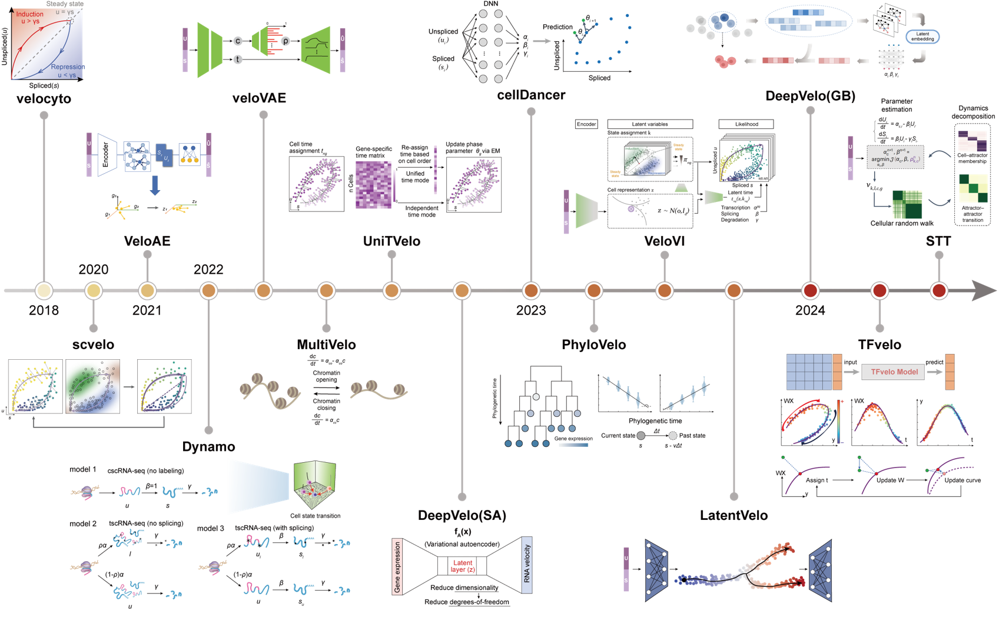

# RNAFusion - 15 RNA Velocity Analysis Tools



Welcome to **RNAFusion**, a comprehensive collection and comparison of 15 state-of-the-art RNA velocity analysis tools. This project integrates methods across multiple categories including machine learning models, deep learning frameworks, and statistical models for RNA velocity inference. Each method is well-documented and includes links to their respective GitHub repositories, along with detailed instructions and descriptions.

## Table of Contents
- [About RNAFusion](#about-rnafusion)
- [15 RNA Velocity Tools](#15-rna-velocity-tools)
- [Project Structure](#project-structure)
- [Getting Started](#getting-started)
- [Dependencies](#dependencies)
- [Running Locally](#running-locally)
- [Contributing](#contributing)
- [License](#license)

## About RNAFusion

RNAFusion provides a unified platform for exploring and analyzing RNA velocity tools. These tools help predict cellular dynamics and understand gene expression regulation. Our project includes an interactive Sphinx-generated website that allows users to browse through various methods, view key innovations, and access the respective research papers and repositories.

## 15 RNA Velocity Tools

This project incorporates the following RNA velocity tools:

1. **velocyto** - A tool for RNA velocity analysis based on steady-state splicing kinetics.
2. **scVelo** - A dynamic modeling framework with EM and latent time for RNA velocity.
3. **VeloAE** - An autoencoder-based method incorporating GCN and attention mechanisms.
4. **VeloVAE** - Variational autoencoder for latent state RNA velocity estimation.
5. **UniTVelo** - Temporally unified, top-down method using radial basis functions.
6. **DeepVelo (2022)** - A neural differential equation model for RNA velocity.
7. **cellDancer** - Single-cell resolution inference for velocity kinetics using DNN.
8. **veloVI** - Variational inference with uncertainty modeling for RNA velocity.
9. **LatentVelo** - Neural ODE and variational autoencoder for RNA velocity in latent space.
10. **DeepVelo (2024)** - GCN-based method for multi-lineage RNA velocity estimation.
11. **STT** - Multiscale dynamical modeling for spatial transcriptomics and RNA velocity.
12. **dynamo** - GMM-based transcriptomic vector field model for RNA velocity.
13. **MultiVelo** - Multi-omic integration of RNA velocity and chromatin accessibility.
14. **PhyloVelo** - Phylogenetic analysis with RNA velocity incorporating gene expression.
15. **TFvelo** - Focuses on transcription factors and regulatory gene expression for RNA velocity.

Each tool is documented with:
- Publication details.
- Core algorithms.
- Key innovations and features.
- Links to research papers and GitHub repositories.
```


## Project Structure

The project is structured as follows:


.
├── docs/                # Sphinx documentation source files
│   ├── _static/         # Static files for styling and customization
│   ├── _templates/      # HTML templates
│   ├── projects/        # RST files for each RNA velocity tool
│   └── index.rst        # Main Sphinx documentation page
├── source/              # Source code and configuration files
│   └── conf.py          # Sphinx configuration file
├── images/              # Image assets for the documentation
├── README.md            # Project readme file
└── requirements.txt     # Python dependencies file


## Getting Started

1. Clone the Repository

To get a local copy of the repository, use:

```bash
git clone https://github.com/your_username/RNAFusion.git
cd RNAFusion
```

2. Install Dependencies

This project uses Sphinx to generate documentation. Install the necessary dependencies using:

```bash
pip install -r requirements.txt
```

3. Build the Documentation Locally

You can build the documentation locally using the following command:

```bash
make html
```

The generated HTML files will be in the `_build/html` directory. Open the `index.html` file in a browser to view the project documentation.

## Dependencies

- Python 3.6+
- Sphinx: Documentation generator.
- sphinx_rtd_theme: Read the Docs theme for Sphinx.
- Other tools: See `requirements.txt`.

## Running Locally

Ensure you have Python and pip installed.

Install the dependencies using `pip install -r requirements.txt`.

Run Sphinx to generate the documentation:

```bash
make html
```

Open `_build/html/index.html` to view the documentation locally.

## Contributing

Contributions are welcome! If you would like to contribute to this project, please follow these steps:

1. Fork the repository.
2. Create a new branch: `git checkout -b feature-branch-name`.
3. Make your changes and commit them: `git commit -m 'Add some feature'`.
4. Push to the branch: `git push origin feature-branch-name`.
5. Open a pull request.

## License

This project is licensed under the MIT License - see the LICENSE file for details.

